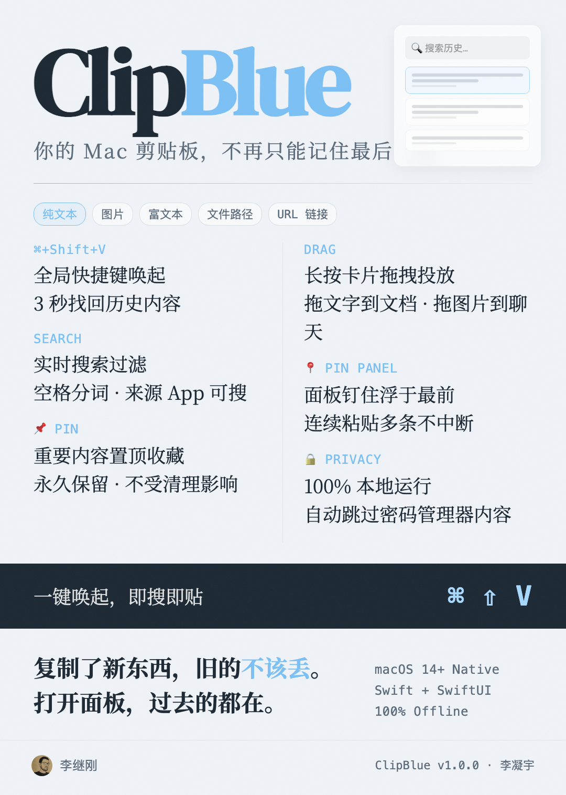

# ClipBlue

> macOS 原生剪贴板历史管理工具——你的剪贴板，不再只能记住最后一条。

<p align="center">
  
</p>

<p align="center">
  
  
  
  
</p>

---

## 一句话介绍

后台自动记录你复制过的所有内容（文字、图片、富文本、文件、链接），按 `⌘ + Shift + V` 随时搜索、回看、再次粘贴。

---

## 功能速览

| 功能 | 说明 |
|---|---|
| 🔍 **自动记录** | 后台实时监听剪贴板变化，无需手动操作 |
| 📝 **多类型支持** | 纯文本、图片、富文本（保留格式）、文件路径、URL 链接 |
| ⌨️ **全局快捷键** | `⌘ + Shift + V` 唤起面板，3 秒内找到历史内容 |
| 🔎 **实时搜索** | 输入即过滤，支持空格分词，支持按来源 App 名称搜索 |
| 📌 **置顶收藏** | 重要内容永久保留，不受自动清理影响 |
| 🖱️ **拖拽投放** | 长按卡片直接拖到其他 App 里 |
| 📍 **面板钉住** | 面板浮在最前，方便连续粘贴多条 |
| 🔒 **隐私保护** | 自动跳过密码管理器内容，100% 本地运行，不联网 |
| 💨 **删除可撤销** | 误删后 5 秒内一键恢复 |
| 🧹 **智能清理** | 默认保留 3 天，到期自动删除（置顶条目永不清除） |
| 🌗 **深色模式** | 完美跟随系统外观自动切换 |

---

## 安装方式

### 方式一：直接安装 .app（推荐）

1. 从 Release 页面下载 `ClipBlue.app`
2. 拖到「应用程序」文件夹
3. **右键** ClipBlue.app → **打开**（首次需要，用于绕过 Gatekeeper）
4. 去「系统设置 → 隐私与安全性 → 辅助功能」授权 ClipBlue
5. 菜单栏出现 📋 图标就安装成功了

### 方式二：从源码编译

```bash
# 克隆仓库
git clone https://github.com/mukulee/ClipBlue.git
cd ClipBlue

# 用 Xcode 打开
open ClipBlue.xcodeproj

# 选择目标 My Mac，⌘ + R 运行
# 或 Product → Archive 打包成 .app
```

**依赖**：仅一个外部依赖 [GRDB.swift](https://github.com/groue/GRDB.swift)（SQLite 封装），Xcode 会自动拉取。

---

## 使用指南

### 基本操作

```
复制 → 唤起面板 → 粘贴

1. 在任何 App 里 ⌘ + C 复制内容
2. 按 ⌘ + Shift + V 打开 ClipBlue 面板
3. 点击卡片即复制，切回目标 App 按 ⌘ + V 粘贴
```

### 键盘快捷键

| 按键 | 功能 |
|---|---|
| `⌘ + Shift + V` | 全局唤起面板 |
| `↑` `↓` | 上下选择卡片 |
| `Enter` | 复制选中卡片并关闭面板 |
| `Esc` | 关闭面板（有搜索先清空搜索） |
| `Delete` | 删除选中卡片 |
| `⌘ + F` | 聚焦搜索框 |
| 直接打字 | 自动搜索 |

### 面板模式

| 触发方式 | 行为 |
|---|---|
| **菜单栏图标点击** | 在图标下方弹出，点外面消失 |
| **⌘ + Shift + V** | 屏幕中央弹出，点外面消失，<br>**可拖动**面板到任意位置 |
| **📍 钉住后** | 浮在最前，切 App 不消失，适合批量粘贴 |

### 保留时长设置

菜单栏右键 → 设置 → 可选 1 天 / 3 天 / 5 天 / 7 天（默认 3 天）。

---

## 系统要求

| 项 | 要求 |
|---|---|
| 操作系统 | **macOS 14 Sonoma** 及以上 |
| 芯片 | Apple Silicon（M 系列）+ Intel（通用二进制） |
| 权限 | 辅助功能权限（用于注册全局快捷键） |

---

## 技术栈

- **语言**：Swift 5.9+
- **UI**：SwiftUI + AppKit 桥接
- **数据库**：SQLite（GRDB.swift）
- **快捷键**：HotKey（Carbon API 封装）
- **包管理**：Swift Package Manager

---

## 数据存储

数据完全本地，不联网、不上传。

- 数据库：`~/Library/Application Support/ClipBlue/database.sqlite`
- 图片：`~/Library/Application Support/ClipBlue/images/`
- 设置：系统 `UserDefaults`

卸载后如需彻底清除数据，手动删除 `~/Library/Application Support/ClipBlue/` 即可。

---

## 作者

李凝宇 · [GitHub](https://github.com/mukulee)

---

## 许可

本项目仅限个人学习与使用。